```{r setup, include=FALSE}
options(htmltools.dir.version = FALSE, htmltools.preserve.raw = FALSE)
knitr::opts_chunk$set(
  fig.width=9, fig.height=3.5, fig.retina=3,
  out.width = "100%",
  cache = FALSE,
  echo = TRUE,
  message = FALSE, 
  warning = FALSE,
  hiline = TRUE
)

library(xaringanthemer)
library(xaringanExtra)
library(showtext)
library(fontawesome)
library(metathis)
library(tidyverse)
library(here)
```

```{r xaringan-themer, include=FALSE, warning=FALSE}
style_duo_accent(
  header_font_google = google_font("News Cycle"),
  text_font_google   = google_font("Dosis", "300", "300i"),
  code_font_google   = google_font("Fira Mono")
)
```

```{r xaringan-extras, echo=FALSE}
# xaringanExtra::use_scribble()
xaringanExtra::use_panelset()
xaringanExtra::use_clipboard()
# xaringanExtra::use_share_again()
```

```{r metathis, echo=FALSE}
meta() %>%
  meta_name("github-repo" = "shaziaruybal/dashboard-mundialFIFA") %>% 
  meta_social(
    title = "Crea tu dashboard en `R`: Visualizando datos del mundial FIFA",
    description = paste(
      "Un taller que te enseñará a crear un dashboard en R utilizando el paquete R Markdown.",
      "Presentado en el Brown Bag Seminar de InnovaLab en octubre 2022."
    ),
    url = "https://shaziaruybal.github.io/dashboard-mundialFIFA/",
    image = "https://shaziaruybal.github.io/dashboard-mundialFIFA/img/social-share-card.png",
    og_type = "website",
    og_author = "Shazia Ruybal-Pesántez",
    twitter_card_type = "summary_large_image",
    twitter_creator = "@DrShaziaRuybal",
    twitter_site = "@DrShaziaRuybal"
  )
```

class: bottom, center, inverse
background-image: url("img/fifa.jpeg")
background-position: top
background-size: 100% 54%

.bottom[
## **`r rmarkdown::metadata$title`**
### **`r rmarkdown::metadata$author`**  
`r rmarkdown::metadata$institute`

`r rmarkdown::metadata$date`

[`r fontawesome::fa(name = "github")` @shaziaruybal](http://github.com/shaziaruybal) | [`r fontawesome::fa(name = "twitter")` @DrShaziaRuybal](http://twitter.com/DrShaziaRuybal) |[`r fontawesome::fa(name = "link")` shaziaruybal.com](https://shaziaruybal.com)  
]
---
name: about-me
class: middle, center, inverse

## ¡Mucho gusto!


### Shazia Ruybal-Pesántez 
#### **Postdoc - Epidemiología Genómica**
##### Imperial College London/MRC Centre for Global Infectious Disease Analysis

[`r fontawesome::fa(name = "github")` @shaziaruybal](http://github.com/shaziaruybal)  
[`r fontawesome::fa(name = "twitter")` @DrShaziaRuybal](http://twitter.com/DrShaziaRuybal)  
[`r fontawesome::fa(name = "link")` shaziaruybal.com](https://shaziaruybal.com)

---
layout: true

<!--this adds the repo link footer to all slides, depends on footer-link class in custom.css-->

<a class="footer-link" href="https://github.com/shaziaruybal/dashboard-mundialFIFA"><strong><i class="fab fa-github"></i> github.com/shaziaruybal/dashboard-mundialFIFA </strong>
&#8226; Brown Bag Seminar </a>

---
name: welcometoR
background-image: url("img/welcome_to_rstats_twitter.png")
background-size: contain
background-position: middle

.footnote[
*Arte por [@alison_horst](https://github.com/allisonhorst/stats-illustrations)*
]

---
class: center, middle

# Conozcámonos un poco

--
## 👍 si te consideras un principiante en `R` y/o `R Markdown` 

--
## ❤️ si te sientes comod@ utilizando `R` y `R Markdown`

---

class: inverse, center
# `r fontawesome::fa("chalkboard")`
# El taller de hoy te enseñará:

--
### Creación de un dashboard utilizando `rmarkdown` y `flexdashboard`

--
### Visualización del dataset del mundial FIFA en un dashboard

--
### Los materiales de este taller están disponibles libremente y pueden servirte como ejemplo para crear tu propio dashboard!

--

.left-column[
.pull-left[
### [`r fontawesome::fa("github")` Materiales](https://github.com/shaziaruybal/dashboard-mundialFIFA)
]]

.right-column[

.pull-left[

### [`r fontawesome::fa("images")` Diapos](http://shaziaruybal.github.io/dashboard-mundialFIFA) 
]

.pull-right[
### [`r fontawesome::fa("youtube")` Grabación](https://youtu.be/Fc1RwRskk08) 
]

]

---

background-image: url("img/rmarkdown_wizards.png")
background-size: 85% 85%
background-position: center

.footnote[
*Art by [@alison_horst](https://github.com/allisonhorst/stats-illustrations)*
]

---
class: center, middle inverse

# `r fa("chart-line")` 
# ¿Por qué un dashboard?


---
# `r fa("chart-line")` Ventajas de un dashboard

--
### - Permite visualizar datasets complejos 

--
### - Enfoque en la información más importante

--
### - Interactividad para el usuario

--
### - Reproducibilidad 

--
### - Muchos casos de uso

---
class: inverse, center, middle

# `r fa("circle-question")` ¿En sus investigaciones o trabajos, para qué utilizarían un dashboard?

---
name: paquete

# Paquete `flexdashboard`

.left-column[
 
]

--

.right-column[
### Desarrollado por RStudio
[`r fa("github")` Repo en Github](https://github.com/rstudio/flexdashboard)

[`r fa("globe")` Documentación](https://pkgs.rstudio.com/flexdashboard/)


- Utiliza `rmarkdown` para publicar visualizaciones estilo dashboard 

- Compatibilidad con varios componentes adicionales incluyendo htmlwidgets; diferentes tipos de gráficos; tablas; botones; y texto.

- El diseño consiste de filas y columnas y es flexible y facil de especificar. Los diferentes componentes se adaptan al tamaño de la pantalla.

- Compatibilidad con `shiny` para visualizaciones dinámicas y con `bslib` para personalizar los colores, fuentes, etc 
]
---

# 👀 Ojo, si no estas familiarizad@ con `rmarkdown`:
- Para este taller vamos a asumir un conocimiento *básico* de `rmarkdown` y `tidyverse`

- [Para más recursos ⬇️](https://rmarkdown.rstudio.com/lesson-1.html) 
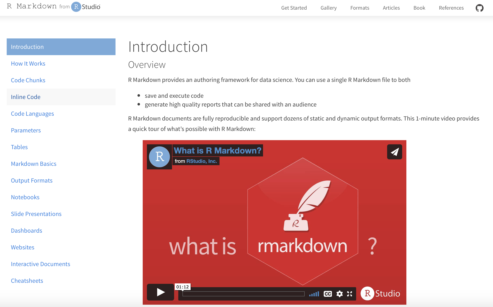

---

class: inverse, center, middle

# ¡Empecemos!


---
## Nuestro objetivo hoy 

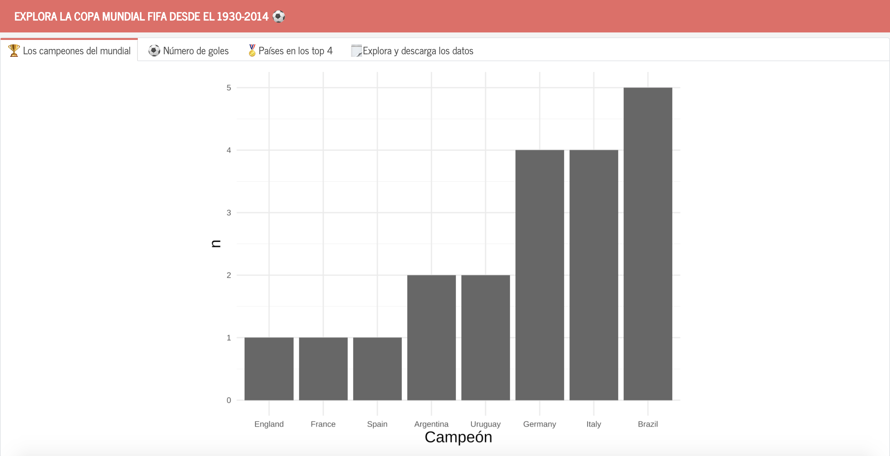 

---
class: inverse, center, middle

## 🇪🇨 pon la bandera o escribe en el chat a quien le vas en el mundial de Qatar 

 


---

class: inverse, center, middle

# Ahora construiremos el dashboard 😍

---
# Pasos a seguir

### 1. Crear una nueva plantilla de `flexdashboard` (y 🧶knit!)
### 2. Cargar datos (y limpieza si es necesario)
### 3. Agregar gráficos y tablas 
### 4. Modificar el formato y/o la paleta de colores 
### 5. 🧶Knit de nuevo!

---
# Paso 1: Crea la plantilla de tu dashboard con `flexdashboard`

.pull-left[
Instala el paquete `flexdashboard`
```{r eval=F}
install.packages("flexdashboard")
```

Carga la libreria
```{r eval=F}
library(flexdashboard)
```

En el IDE de RStudio, crea un nuevo documento de R Markdown 
`File -> New File -> R Markdown -> From Template`

**`r fontawesome::fa("lightbulb")` Tip: ** Usa la plantilla "themed with {bslib}" para más flexibilidad en la presentación
]

.pull-right[
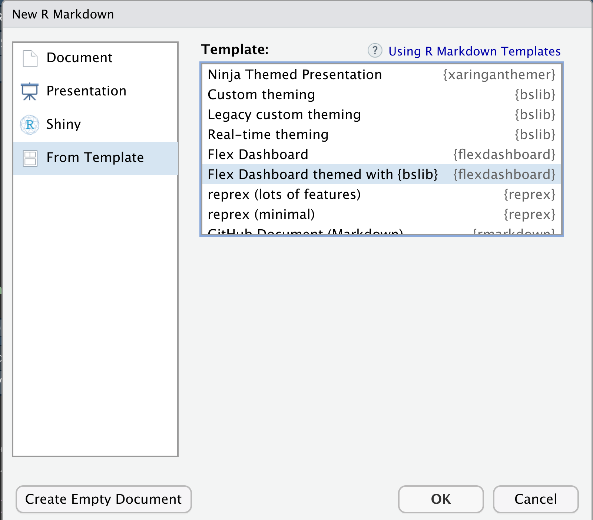

]

---
class: inverse, center, middle

# Para ver el dashboard "default", haz click en 🧶Knit

---
class: top, center

<video width="1530" height="610" controls>
  <source src="vid/flex_default.mp4" type="video/mp4"> 
</video>

---
# `r fontawesome::fa("x-ray")` La anatomía de un `flexdashboard` .Rmd

.pull-left[ 
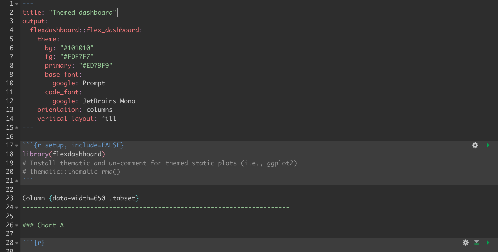 

]

.pull-right[
**Encabezado** 

- A traves del YAML podemos modificar el título, los colores, la orientación

**Columns**

- La orientación de cada dashboard puede manejarse con columnas o filas (formato R Markdown)
- Puedes controlar el tamaño con `data-width=` o `data-height=` 

**`r fontawesome::fa("lightbulb")` Tip: ** Utiliza `.tabset` para crear pestañas 

]

---
# `r fontawesome::fa("x-ray")` La anatomía de un `flexdashboard` .Rmd

.pull-left[
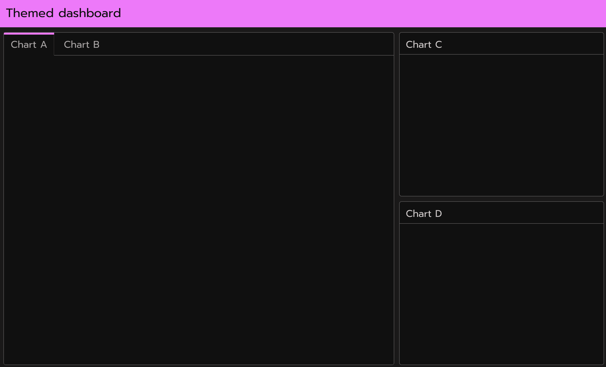
]

.pull-right[

**Encabezado** 

- A traves del YAML podemos modificar el título, los colores, la orientación

**Charts**

- La orientación de cada dashboard puede manejarse con columnas o filas (formato R Markdown)

]


---
class: inverse

# `r fa("table")` Paso 2: Cargar datos

### Utilizaremos los datos de los mundiales de la FIFA del 1930-2014 que se encuentran en Kaggle [kaggle.com/datasets/abecklas/fifa-world-cup](https://www.kaggle.com/datasets/abecklas/fifa-world-cup)

--
### Son 3 documentos .csv:

* WorldCupMatches.csv
* WorldCupPlayers.csv
* WorldCups.csv

--

### Puedes encontrar los datos del taller de hoy aquí: [github.com/shaziaruybal/dashboard-mundialFIFA/data](https://github.com/shaziaruybal/dashboard-mundialFIFA/blob/main/data/)

---
# `r fa("table")` Paso 2: Cargar datos

.pull-left[
Para cargar los datos asignamos objetos a cada dataset

```{r}
partidos <- read.csv("data/WorldCupMatches.csv")
jugadores <- read.csv("data/WorldCupPlayers.csv")
copas <- read.csv("data/WorldCups.csv")
```

#### Ojo que hoy no nos enfocaremos en limpieza de datos

**`r fontawesome::fa("lightbulb")` Tip: ** Carga tus datos en el chunk de "setup"
]

.pull-right[
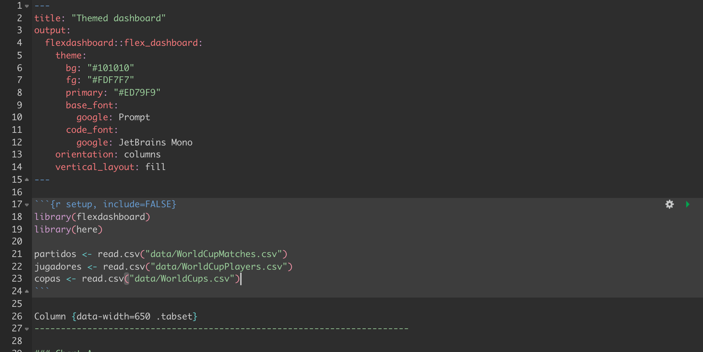
]

---
# `r fa("table")` Exploremos que contiene cada dataset

```{r}
head(copas)
```

---
# `r fa("table")` Exploremos que contiene cada dataset

```{r}
head(jugadores)
```

---
# `r fa("table")` Exploremos que contiene cada dataset

```{r}
head(partidos)
```


---
# `r fa("chart-line")` Paso 3: Agregar gráficos y tablas 

.panelset.sideways[
.panel[.panel-name[Visualiza los ganadores]
```{r eval=F}
copas %>% 
  mutate(Winner = case_when(Winner == "Germany FR" ~ "Germany",
                            TRUE ~ Winner)) %>% 
  count(Winner) %>% 
  ggplot(aes(x=reorder(Winner,n), y=n)) +
    geom_col() +
    xlab("Campeón") +
    theme_minimal()
```
]

.panel[.panel-name[Output]
```{r echo=F}
copas %>% 
  mutate(Winner = case_when(Winner == "Germany FR" ~ "Germany",
                            TRUE ~ Winner)) %>% 
  count(Winner) %>% 
  ggplot(aes(x=reorder(Winner,n), y=n)) +
    geom_col() +
    xlab("Campeón") +
    theme_minimal()
```

]

.panel[.panel-name[Visualiza los goles]


```{r eval=F}
copas %>% 
  ggplot(aes(x=Year, y=GoalsScored)) +
    geom_line() +
    geom_point() +
    theme_minimal()
```

]

.panel[.panel-name[Output]
```{r echo=F}
copas %>% 
  ggplot(aes(x=Year, y=GoalsScored)) +
    geom_line() +
    geom_point() +
    theme_minimal()
```

]
.panel[.panel-name[Visualiza los top 4]


```{r eval=F}
copas %>% 
  select(Winner:Fourth) %>% 
  pivot_longer(cols=Winner:Fourth, names_to="lugar", values_to="pais") %>% 
  mutate(pais = case_when(pais == "Germany FR" ~ "Germany",
                            TRUE ~ pais)) %>% 
  count(pais) %>% 
  ggplot(aes(x=reorder(pais,n), y=n)) +
    geom_col() +
    xlab("País") +
    theme_minimal() +
    theme(axis.text.x = element_text(angle = 45)) 
```

]

.panel[.panel-name[Output]
```{r echo=F}
copas %>% 
  select(Winner:Fourth) %>% 
  pivot_longer(cols=Winner:Fourth, names_to="lugar", values_to="pais") %>% 
  mutate(pais = case_when(pais == "Germany FR" ~ "Germany",
                            TRUE ~ pais)) %>% 
  count(pais) %>% 
  ggplot(aes(x=reorder(pais,n), y=n)) +
    geom_col() +
    xlab("País") +
    theme_minimal() +
    theme(axis.text.x = element_text(angle = 45)) 
```

]
.panel[.panel-name[Incluye una tabla]

Utiliza el paquete `DT` para mayor interactividad
```{r eval=F}
library(DT)

datatable(copas,
          extensions = "Buttons", 
            options = list(dom = "Bfrtip", 
                           buttons = (list(
                             "copy", list(
                               extend = "collection", 
                               buttons = c("csv", "excel"), 
                               text = "Download")))), 
            rownames = F, 
            filter = "top",
            style = "bootstrap")
```

]

.panel[.panel-name[Output]

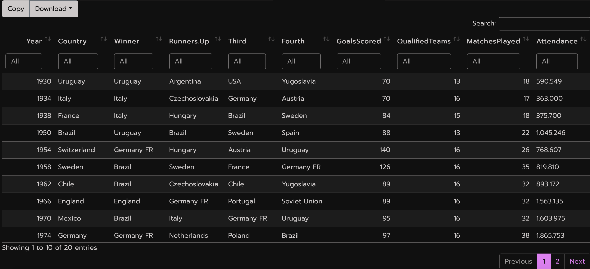
]

.panel[.panel-name[Modifica el YAML]
```{r eval=F}
---
title: "Explora la copa mundial FIFA desde el 1930-2014"
output: 
  flexdashboard::flex_dashboard:
    theme:
      bg: "#101010"
      fg: "#FDF7F7" 
      primary: "#ED79F9"
      base_font:
        google: Prompt
      code_font:
        google: JetBrains Mono
    orientation: columns
    vertical_layout: fill
---
```

]

]

---
# `r fa("chart-line")` Paso 3: Agregar gráficos y tablas 

.pull-left[
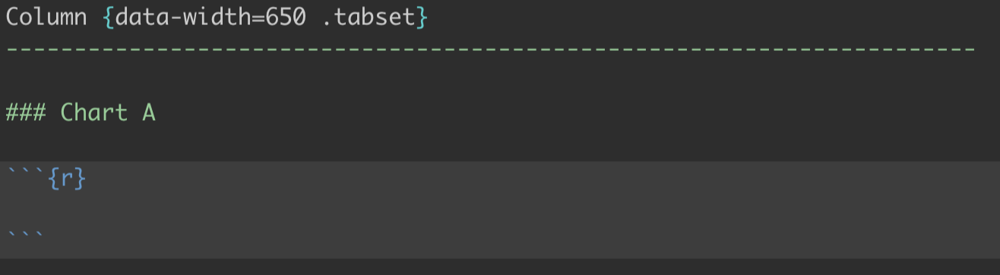
]

.pull-right[
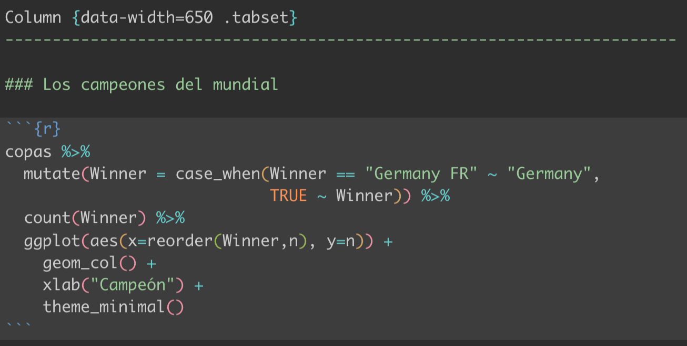
]

### ☑️ Hacemos lo mismo para los otros gráficos

---
# `r fontawesome::fa("lightbulb")` Tips

--
### - En el YAML puedes cambiar los colores a tu gusto, pero también existen temas de Bootswatch ya predeterminados que puedes utilizar. Encuéntralos en [bootswatch.com](https://bootswatch.com) 

--
### - Puedes agregar interactividad a tus gráficos utilizando el paquete `plotly`

--
### - Puedes aplicar tu tema o paleta de colores a tus gráficos también

```{r eval=F}
thematic::thematic_rmd(font = "auto")
```


---
# `r fa("palette")` Paso 4: Modificar el formato y/o la paleta de colores 

### Cambia el tema y la paleta de colores 

.pull-left[
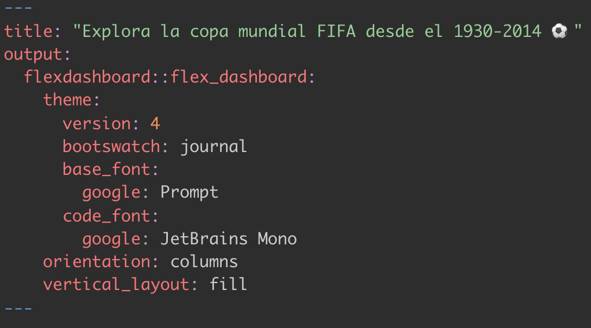
]

.pull-right[
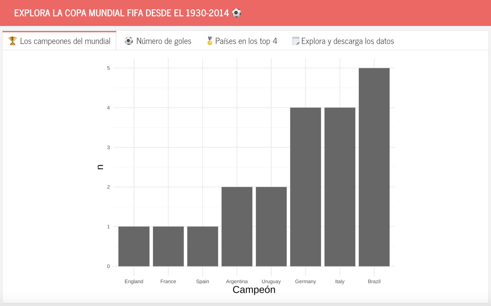
👀 *Quitamos la columna extra para que todos nuestros gráficos estén en una pestaña*
]

---
# `r fa("palette")` Paso 4: Modificar el formato y/o la paleta de colores 

### Agrega interactividad con el paquete `plotly`
.pull-left[
```{r eval=F}
library(plotly)

ggplotly(copas %>% 
  mutate(Winner = case_when(Winner == "Germany FR" ~ "Germany",
                            TRUE ~ Winner)) %>% 
  count(Winner) %>% 
  ggplot(aes(x=reorder(Winner,n), y=n)) +
    geom_col() +
    xlab("Campeón") +
    theme_minimal())
```

]

.pull-right[
```{r include=F}
library(plotly)

ggplotly(copas %>% 
  mutate(Winner = case_when(Winner == "Germany FR" ~ "Germany",
                            TRUE ~ Winner)) %>% 
  count(Winner) %>% 
  ggplot(aes(x=reorder(Winner,n), y=n)) +
    geom_col() +
    xlab("Campeón") +
    theme_minimal(), 
  width=300, height=200)
```

]

---

.left-column[
### `r fa("magic")` Paso 5: 🧶Knit de nuevo!
]

.right-column[

]
---
class: center, middle


### ¡Lo logramos!

--
#### `r fa("github")` Para ver el archivo .Rmd de nuestro `flexdashboard`, haz click [aquí](https://github.com/shaziaruybal/dashboard-mundialFIFA/blob/main/dashboard.rmd).
#### `r fa("download")` Descarga nuestro dashboard en .html para abrirlo en tu navegador [aquí](https://github.com/shaziaruybal/dashboard-mundialFIFA/blob/main/dashboard.html)


---
# `r fa("lightbulb")` Más recursos y ejemplos

#### [Más información sobre flexdashboard](https://rstudio.github.io/flexdashboard/articles/flexdashboard.html)
#### [Más información sobre los temas de flexdashboard](https://rstudio.github.io/flexdashboard/articles/theme.html#bootstrap-and-bslib-1)
#### [Aquí puedes encontrar los temas de Bootswatch](https://bootswatch.com)
#### [Información acerca de incluir Shiny en tu flexdashboard](https://pkgs.rstudio.com/flexdashboard/articles/shiny.html)
#### [Ejemplos de otros flexdashboards](https://pkgs.rstudio.com/flexdashboard/articles/examples.html)

---

class: inverse, center, middle

# `r fa("arrow-up-right-from-square")` Casos de uso: Demo y ejemplos de dashboards que yo he creado

---
name: contact
class: inverse

.pull-left[
.center[
### Dra Shazia Ruybal-Pesántez 


#### ¡Estoy a las órdenes!

[`r fa(name = "envelope")` sruybal@imperial.ac.uk](mailto:sruybal@imperial.ac.uk)  
[`r fa(name = "twitter")` @DrShaziaRuybal](https://twitter.com/DrShaziaRuybal)

]]

.pull-right[

### Materiales de este taller:

### [`r fa("github")` Repo](https://github.com/shaziaruybal/dashboard-mundialFIFA)
### [`r fa("image")` Diapositivas](https://shaziaruybal.github.io/dashboard-mundialFIFA)
### [`r fa("youtube")` Grabación (próximamente)]()  


.footnote[
_Estas diapositivas fueron creadas utilizando los paquetes de R:  
[xaringan](https://github.com/yihui/xaringan), 
[xaringanthemer](https://github.com/gadenbuie/xaringanthemer), 
[xaringanExtra](https://github.com/gadenbuie/xaringanExtra)_ 
]
]


---
class: inverse, middle, center

# ¡Muchas gracias!

--
# `r fa("circle-question")` ¿Preguntas?

---
class: left

# `r fa("list-check")` Actividad (opcional)

--

#### `r fa("square-check")` Si no lo has hecho todavía, intenta recrear el dashboard que vimos juntos en el taller 

--

#### `r fa("square-check")` Intenta crear nuevas visualizaciones o modifica el tema de tu dashboard

--

#### `r fa("square-check")` Explora otros aspectos de los datos de los mundiales y visualizalos en tu dashboard

--

#### `r fa("square-check")` Comparte tu dashboard con el resto

--

.footnote[
Si quieres empezar desde el .rmd que creamos juntos, lo puedes encontrar [aquí `r fa("arrow-up-right-from-square")`](https://shaziaruybal.github.io/dashboard-mundialFIFA/dashboard.rmd) 
]

